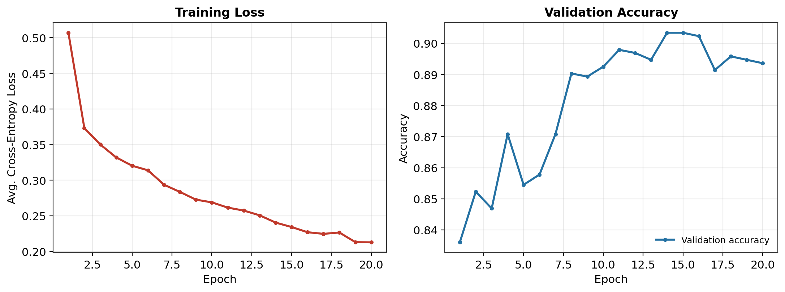
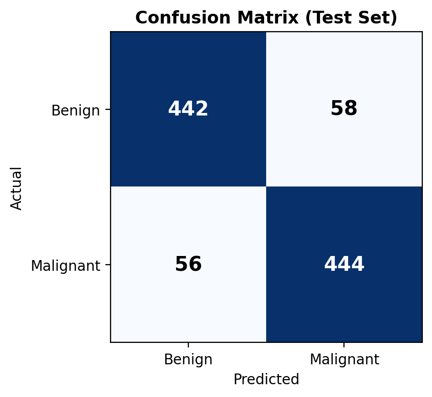

# Results

## Final model

- **Architecture:** 3-layer CNN (see [`model.py`](model.py))
- **Input:** 100×100 RGB skin lesion images
- **Test accuracy:** **88.6%**
- **Final validation accuracy (epoch 20):** 89.4%
- **Training set:** 8,289 images (balanced, 50/50 benign/malignant)
- **Validation set:** 921 images (10% held out from training data)
- **Test set:** 1,000 images (500 benign / 500 malignant, untouched during training)

## Training curves

Loss decreases smoothly and validation accuracy climbs from ~84% to ~90% over
20 epochs, tracking closely with the final test accuracy (dashed line). There
is no divergence between training loss and validation accuracy, a sign the
model is generalizing rather than memorizing the training set.

Raw data behind this chart: [`training_log.csv`](training_log.csv), written
automatically by `train.py` each run. Regenerate the plot at any time with
`python visualize_training.py`.

## Confusion matrix and per-class metrics

Overall accuracy hides how errors are distributed between classes, which
matters more than the headline number for a screening task like this one, 
a missed malignant case (false negative) is a far more costly error than a
false alarm on a benign case (false positive).

| Metric | Value | What it measures |
|---|---|---|
| Accuracy | 88.6% | Overall correct predictions |
| Malignant recall (sensitivity) | **88.8%** | Of actual malignant cases, how many were caught |
| Malignant precision | 88.4% | Of cases flagged malignant, how many actually were |
| Benign specificity | 88.4% | Of actual benign cases, how many were correctly cleared |

| | Predicted Benign | Predicted Malignant |
|---|---:|---:|
| **Actual Benign**    | 442 (TN) | 58 (FP) |
| **Actual Malignant** | 56 (FN)  | 444 (TP) |

**56 out of 500 malignant test cases were missed** (classified as benign).
Precision, recall, and specificity all land close together (~88–89%),
meaning the model isn't strongly biased toward either error type, but none
of the three numbers is anywhere close to what a screening tool would need
in practice. See [Known Limitations](#known-limitations) below.

## Epoch-by-epoch data

| Epoch | Avg. Loss | Val. Accuracy |
|------:|----------:|--------------:|
| 1  | 0.5069 | 83.60% |
| 2  | 0.3731 | 85.23% |
| 3  | 0.3501 | 84.69% |
| 4  | 0.3319 | 87.08% |
| 5  | 0.3203 | 85.45% |
| 6  | 0.3138 | 85.78% |
| 7  | 0.2936 | 87.08% |
| 8  | 0.2835 | 89.03% |
| 9  | 0.2727 | 88.93% |
| 10 | 0.2689 | 89.25% |
| 11 | 0.2615 | 89.79% |
| 12 | 0.2574 | 89.69% |
| 13 | 0.2507 | 89.47% |
| 14 | 0.2405 | 90.34% |
| 15 | 0.2343 | 90.34% |
| 16 | 0.2270 | 90.23% |
| 17 | 0.2247 | 89.14% |
| 18 | 0.2266 | 89.58% |
| 19 | 0.2131 | 89.47% |
| 20 | 0.2128 | 89.36% |

## What was tried and ruled out

In the interest of documenting the actual process rather than only the final
result:

- **Transfer learning (ResNet18, full fine-tune):** underperformed the
  from-scratch model (89.1% test accuracy) with clear signs of overfitting, 
  training loss dropped to 0.02 while validation/test accuracy stayed well
  below that level.
- **Transfer learning (ResNet18, frozen backbone):** underfit instead, 
  training loss rose to 0.36 and accuracy dropped further (82.6% test
  accuracy), most likely because ResNet's BatchNorm layers continued
  updating their running statistics on lesion images despite the rest of
  the network being frozen, degrading the pretrained features.
- Given both attempts introduced new failure modes without a clear net
  improvement, the from-scratch CNN above was kept as the reported result.
  Revisiting transfer learning with a corrected BatchNorm-freezing
  implementation and/or data augmentation is a natural next step (see
  [Future Work](README.md#future-work) in the main README).

## Known limitations

- **Not clinically viable.** 88.6% accuracy, and 88.8% malignant recall in
  particular, are far below the reliability bar required for real
  diagnostic use, 56 missed malignant cases out of 500 would be an
  unacceptable false-negative rate in any real screening context.
- **No dataset-level bias analysis.** Performance has not been checked
  across skin tones, lesion types, or image sources, all of which are
  known failure points for dermatology imaging models in practice.
- **Small dataset, no augmentation.** ~9,200 training images is modest for
  a vision task; no rotation/flip/color-jitter augmentation has been
  applied yet, which likely limits how well the model generalizes beyond
  this specific dataset's imaging conditions.
- **Resolution tradeoffs.** Images are resized to 100×100, enough to
  capture coarse structure, but likely losing fine border and texture
  detail that dermatological assessment (the ABCDE rule) relies on.